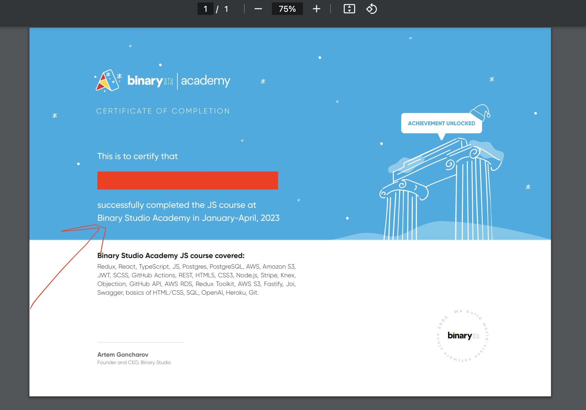

# BSA Certificate Updates

<p align="center">
  
</p>

## Calculations

```
GRADUATION_STATUS =
  IF studentGrade >= 3 AND < 3.80 THEN 'Satisfactorily'
  OTHERWISE IF studentGrade >= 3.80 AND < 4.60 THEN 'Well'
  OTHERWISE IF studentGrade >= 4.60 THEN 'Successfully'
```

```
PROJECT_PASS_STATUS =
  IF isQualityCriteriaPassed = true THEN 'and defended the final project on'
  OTHERWISE ''
```

`{{ GRADUATION_STATUS }}` completed `{{ PROJECT_PASS_STATUS }}` JS course at Binary Studio Academy in January-April, 2023

## Examples

- ### Example 1

  #### Payload
  ```
  studentGrade = 3.60
  GRADUATION_STATUS = Satisfactorily

  isQualityCriteriaPassed = false
  PROJECT_PASS_STATUS = ''
  ```

  #### Result
  > *Satisfactorily* completed JS course at Binary Studio Academy in January-April, 2023

___

- ### Example 2

  #### Payload
  ```
  studentGrade = 4.40
  GRADUATION_STATUS = Well

  isQualityCriteriaPassed = true
  PROJECT_PASS_STATUS = 'and defended the final project on'
  ```

  #### Result
  > *Well* completed *and defended the final project on* JS course at Binary Studio Academy in January-April, 2023

___

- ### Example 3

  #### Payload
  ```
  studentGrade = 4.80
  GRADUATION_STATUS = Well

  isQualityCriteriaPassed = true
  PROJECT_PASS_STATUS = 'and defended the final project on'
  ```

  #### Result
  > *Successfully* completed *and defended the final project on* JS course at Binary Studio Academy in January-April, 2023
